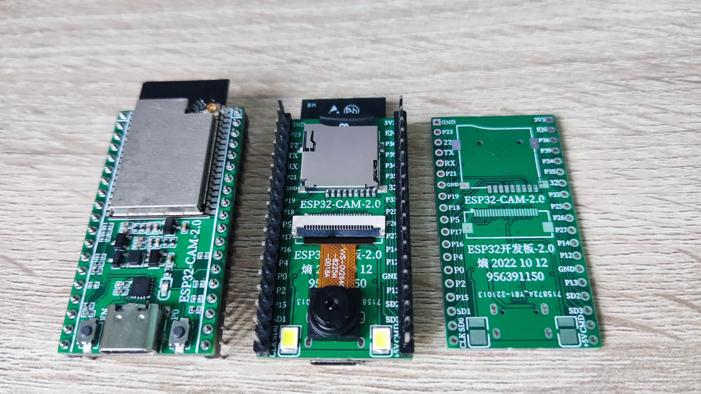
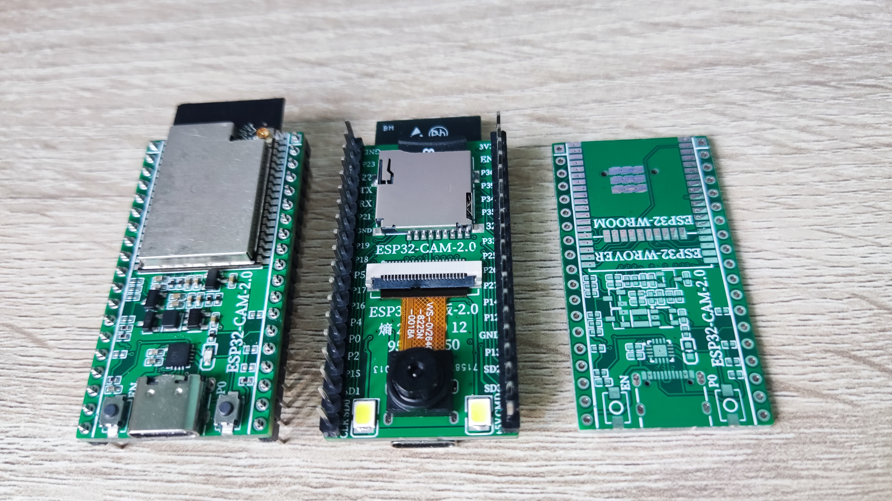
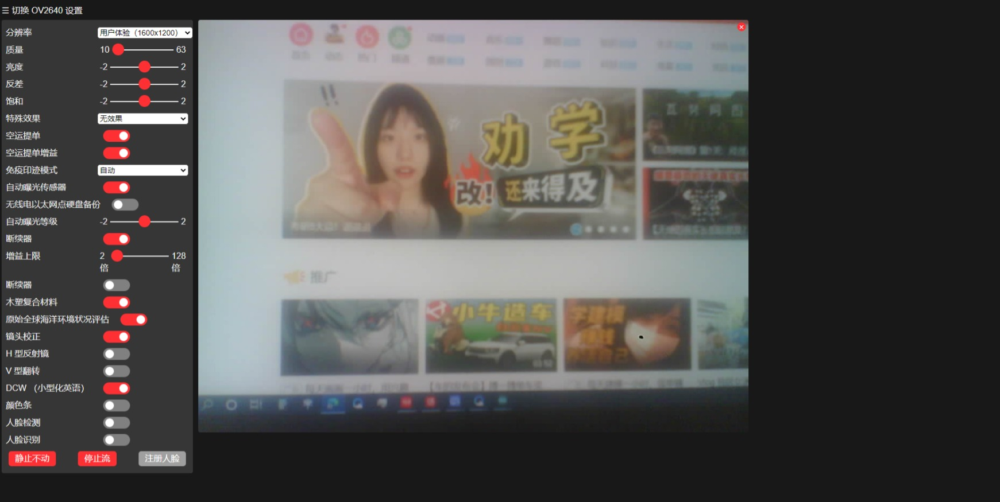

# ESP32-CAM-2.0开发板

#### 介绍
这是一个开源硬件的 ESP32-CAM 开发板  

#### 硬件架构
1. ESP32-CAM-2.0开发板摄像头模块和TF卡座连接方式和AI Thinker ESP32 CAM相同 
2. 开发板推荐使用ESP32-WROVER模块  自带8MB PSRAM   和4MB Flash  能更好的支持ESP32-CAM应用
3. ESP32-CAM-2.0开发板引脚完全兼容普通开发板引脚 支持焊接ESP32-WROVER模块和 ESP32-WROOM模块
4. ESP32-CAM-2.0开发板完全当普通ESP32开发板使用时建议用不焊几个信号引脚的上下拉电阻和不安装摄像头和TF卡 
5. 使用CH343P  USB转串口芯片 支持一键烧录下载程序
6. 电源使用 DC-DC 5V转3.3V和两路LDO  3.3V转2.8V  3.3V转1.2V 解决上一版因电源问题引起的图像条纹噪点
7. PCB 生产工艺  4层板 1.6板厚  大部分0402元件封装  元件参数以原理图参数为准   硬件相关资料在附件内 

#### 其他平台
1. 熵 2022 10 22
2. 立创开源平台：https://oshwhub.com/fj956391150/esp32-cam

